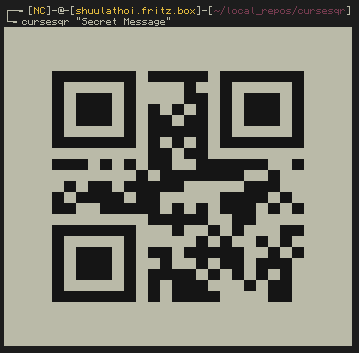

# CursesQR

---

`cursesqr` is a simply command line utility that can generate QR codes and print
them to stdout, file, or to an Ncurses display. QR codes can be customized by
color and unicode drawing characters. QR code generation is handled using
Nayuki's [QR-Code-generator](https://github.com/nayuki/QR-Code-generator).

# Usage

`cursesqr -h`

# Dependencies

* curses
* [QR-Code-generator](https://github.com/nayuki/QR-Code-generator)

# Installation

`python setup.py install`

